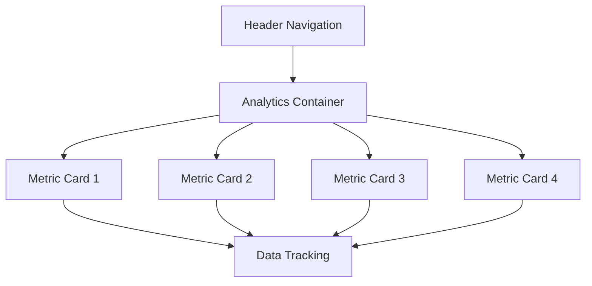

## 1. Product Overview

Redesign the header section to restore missing functionality while implementing a new 2x2 grid layout for analytics display. This enhancement maintains all original interactive elements and navigation features while improving data visualization.

The product improves user experience by providing clear metric visualization in an organized grid layout while preserving existing data tracking capabilities.

## 2. Core Features

### 2.1 User Roles

No specific user roles required - all users interact with the same header and analytics display.

### 2.2 Feature Module

Our header analytics redesign consists of the following main components:

1. **Header section**: navigation, interactive elements, restored functionality
2. **Analytics container**: 2x2 grid layout with four key metrics

### 2.3 Page Details

| Page Name | Module Name         | Feature description                                                  |
| --------- | ------------------- | -------------------------------------------------------------------- |
| Header    | Navigation bar      | Restore all missing interactive elements and navigation features     |
| Header    | Analytics container | Display four key metrics in 2x2 grid pattern with consistent spacing |
| Analytics | Metric cards        | Show individual metrics with proper visual hierarchy and typography  |
| Analytics | Responsive layout   | Adapt grid layout across all device sizes                            |
| Analytics | Data binding        | Preserve existing data tracking and reporting capabilities           |

## 3. Core Process

User Flow: Users interact with the header navigation while viewing real-time analytics data in the redesigned 2x2 grid layout. All interactive elements remain functional during data visualization.

## 4. User Interface Design

### 4.1 Design Style

* Primary colors: Maintain existing brand colors

* Typography: Clear hierarchy with appropriate font sizes for metrics

* Layout: Card-based 2x2 grid within defined container

* Spacing: Consistent padding and margins between grid elements

* Icons: Minimal, data-focused iconography

### 4.2 Page Design Overview

| Component | Module Name      | UI Elements                                                     |
| --------- | ---------------- | --------------------------------------------------------------- |
| Header    | Navigation       | Maintain existing navigation structure and interactive elements |
| Analytics | Grid container   | 2x2 grid layout with equal spacing, responsive breakpoints      |
| Metrics   | Individual cards | Clean typography, proper contrast, hover states                 |

### 4.3 Responsiveness

Desktop-first design approach with mobile adaptation. Grid layout adjusts from 2x2 on desktop to stacked layout on mobile devices while maintaining readability and interaction capabilities.

### 4.4 Data Visualization

* Clear metric labels and values

* Consistent number formatting

* Visual indicators for trends (if applicable)

* Maintain existing data refresh/update patterns

