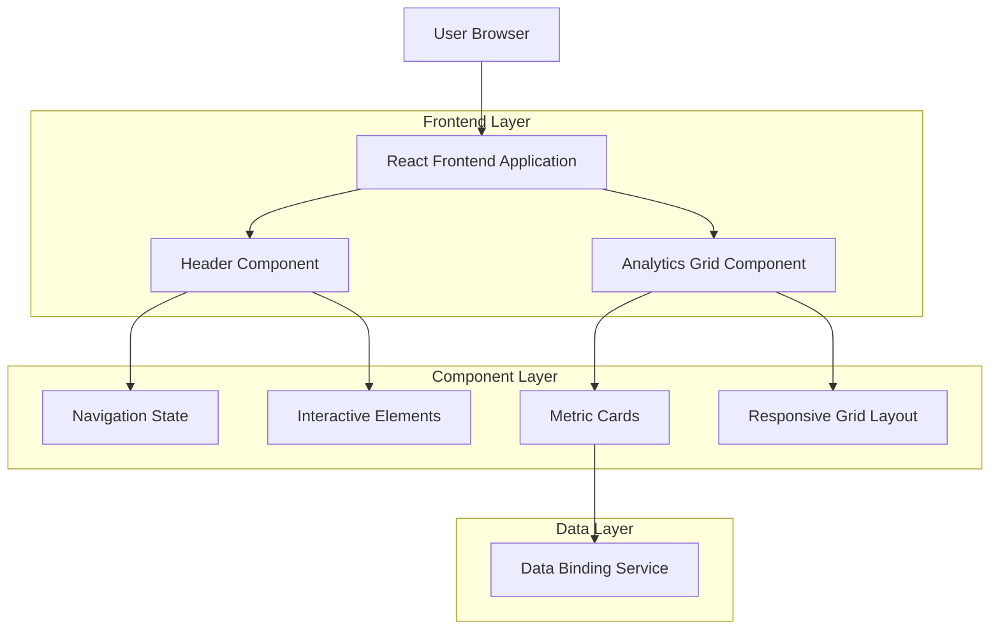
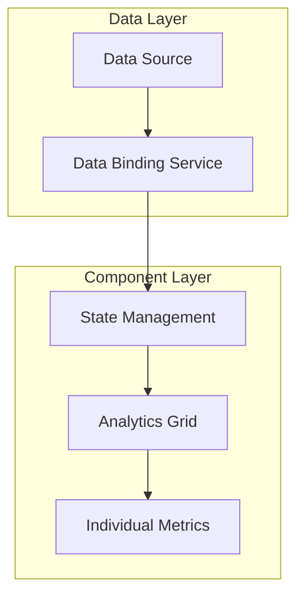

## 1. Architecture Design



## 2. Technology Description
- Frontend: React@18 + tailwindcss@3 + vite
- Initialization Tool: vite-init
- Backend: None (preserves existing data bindings)
- State Management: React hooks for component state
- Responsive Design: CSS Grid with Tailwind breakpoints

## 3. Route Definitions
| Route | Purpose |
|-------|---------|
| / | Home page with header and analytics display |
| * | All existing routes maintain header functionality |

## 4. Component Architecture

### 4.1 Header Component Structure
```typescript
interface HeaderProps {
  navigationItems: NavigationItem[];
  onNavigationClick: (route: string) => void;
  analyticsData: AnalyticsMetric[];
}

interface NavigationItem {
  label: string;
  route: string;
  isActive: boolean;
}
```

### 4.2 Analytics Grid Component
```typescript
interface AnalyticsGridProps {
  metrics: AnalyticsMetric[];
  gridLayout: '2x2' | 'responsive';
}

interface AnalyticsMetric {
  id: string;
  label: string;
  value: number | string;
  format?: 'number' | 'percentage' | 'currency';
  trend?: 'up' | 'down' | 'neutral';
}
```

### 4.3 Responsive Breakpoints
```css
/* Desktop: 2x2 grid */
.grid-cols-2 {
  grid-template-columns: repeat(2, 1fr);
}

/* Mobile: stacked layout */
@media (max-width: 768px) {
  .grid-cols-1 {
    grid-template-columns: 1fr;
  }
}
```

## 5. Data Binding Implementation

### 5.1 Metric Data Flow


### 5.2 Grid Layout System
- CSS Grid implementation for 2x2 layout
- Consistent gap spacing (gap-4 or gap-6)
- Equal height cards using grid-auto-rows
- Responsive breakpoints for mobile adaptation

## 6. Component Structure

### 6.1 Header Restoration Checklist
- [ ] Navigation items functionality verified
- [ ] Interactive elements restored
- [ ] Event handlers properly bound
- [ ] Accessibility features maintained
- [ ] Mobile menu functionality preserved

### 6.2 Analytics Grid Implementation
- [ ] 2x2 grid layout with consistent spacing
- [ ] Typography hierarchy implemented
- [ ] Responsive behavior tested
- [ ] Data visualization preserved
- [ ] Loading states handled
- [ ] Error boundaries implemented

## 7. Testing Requirements

### 7.1 Functionality Tests
- Header navigation click events
- Analytics data binding accuracy
- Responsive layout breakpoints
- Interactive element states

### 7.2 Performance Tests
- Grid rendering performance
- Data update frequency
- Mobile touch interactions
- Cross-browser compatibility