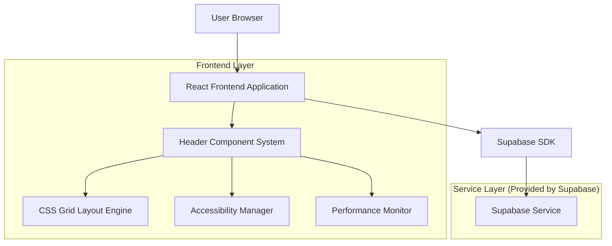
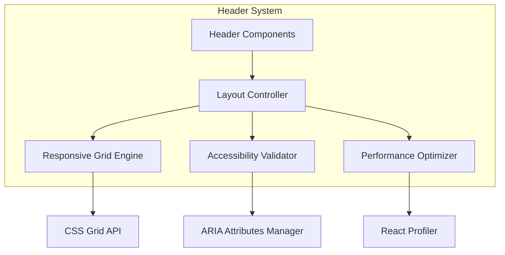

## 1.Architecture design



## 2.Technology Description
- Frontend: React@18 + tailwindcss@3 + vite + CSS Grid
- Backend: Supabase
- Accessibility: WAI-ARIA standards + semantic HTML5
- Performance: React.memo + lazy loading + CSS containment

## 3.Route definitions
| Route | Purpose |
|-------|---------|
| / | Main dashboard with modernized header |
| /profile | User profile with responsive header |
| /analytics | Analytics page with adaptive header layout |
| /settings | Settings page with compact header variant |

## 4.Component Architecture

### 4.1 Core Header Components
```typescript
interface HeaderProps {
  variant: 'full' | 'compact' | 'minimal';
  breakpoint: 'mobile' | 'tablet' | 'desktop';
  userRole: 'admin' | 'manager' | 'user';
}
```

### 4.2 Grid Layout System
```css
.header-container {
  display: grid;
  grid-template-areas: 
    "logo nav search profile"
    "logo nav actions profile";
  grid-template-columns: 200px 1fr 300px 200px;
  gap: 1rem;
}

@media (max-width: 768px) {
  .header-container {
    grid-template-areas: 
      "logo menu"
      "search search"
      "profile profile";
    grid-template-columns: 1fr auto;
  }
}
```

## 5.Server architecture diagram


## 6.Performance Optimization Strategy

### 6.1 Component Memoization
```typescript
const HeaderLogo = React.memo(({ logoUrl }: { logoUrl: string }) => (
  <div className="header-logo" role="img" aria-label="Company Logo">
    
  </div>
));
```

### 6.2 CSS Containment
```css
.header-nav {
  contain: layout style paint;
  will-change: transform;
}

.header-search {
  contain: layout;
}
```

### 6.3 Lazy Loading Strategy
```typescript
const HeaderActions = lazy(() => import('./HeaderActions'));
const HeaderNotifications = lazy(() => import('./HeaderNotifications'));
```

## 7.Accessibility Implementation

### 7.1 Semantic HTML Structure
```html
<header role="banner" aria-label="Main navigation">
  <nav role="navigation" aria-label="Primary navigation">
    <ul role="menubar">
      <li role="none">
        <button role="menuitem" aria-expanded="false">
          Dashboard
        </button>
      </li>
    </ul>
  </nav>
  <div role="search" aria-label="Site search">
    <input type="search" aria-label="Search" aria-describedby="search-help" />
    <div id="search-help" class="sr-only">
      Enter search terms and press Enter
    </div>
  </div>
</header>
```

### 7.2 Keyboard Navigation
```typescript
const useKeyboardNavigation = () => {
  useEffect(() => {
    const handleKeyDown = (e: KeyboardEvent) => {
      switch (e.key) {
        case 'Tab':
          // Handle focus management
          break;
        case 'Enter':
        case ' ':
          // Handle activation
          break;
        case 'Escape':
          // Handle menu closing
          break;
      }
    };
    document.addEventListener('keydown', handleKeyDown);
    return () => document.removeEventListener('keydown', handleKeyDown);
  }, []);
};
```

## 8.Responsive Grid Implementation

### 8.1 Mobile-First Grid System
```css
.header-grid {
  display: grid;
  gap: 0.75rem;
  padding: 0.5rem;
  
  /* Mobile: Single column */
  grid-template-areas: 
    "logo"
    "menu"
    "search"
    "profile";
  grid-template-columns: 1fr;
}

/* Tablet: Two columns */
@media (min-width: 768px) {
  .header-grid {
    grid-template-areas: 
      "logo menu"
      "search search"
      "profile profile";
    grid-template-columns: auto 1fr;
  }
}

/* Desktop: Full layout */
@media (min-width: 1024px) {
  .header-grid {
    grid-template-areas: 
      "logo nav search profile"
      "logo nav actions profile";
    grid-template-columns: 200px 1fr 300px 200px;
  }
}
```

### 8.2 Component-Based Grid Areas
```typescript
const HeaderGrid = ({ children }: { children: React.ReactNode }) => {
  return (
    <div className="header-grid">
      <div className="grid-area-logo">{children.find(c => c.type === HeaderLogo)}</div>
      <div className="grid-area-nav">{children.find(c => c.type === HeaderNav)}</div>
      <div className="grid-area-search">{children.find(c => c.type === HeaderSearch)}</div>
      <div className="grid-area-profile">{children.find(c => c.type === HeaderProfile)}</div>
    </div>
  );
};
```

## 9.Modern HTML Structure

### 9.1 Component-Based Markup
```html
<header class="header-container" role="banner">
  <div class="header-grid">
    <section class="header-branding" grid-area="logo">
      <a href="/" aria-label="Home">
        
      </a>
    </section>
    
    <nav class="header-navigation" grid-area="nav" role="navigation" aria-label="Main">
      <ul class="nav-list" role="menubar">
        <li role="none"><a href="/dashboard" role="menuitem">Dashboard</a></li>
        <li role="none"><a href="/analytics" role="menuitem">Analytics</a></li>
        <li role="none"><a href="/settings" role="menuitem">Settings</a></li>
      </ul>
    </nav>
    
    <section class="header-search" grid-area="search" role="search">
      <label for="global-search" class="sr-only">Search</label>
      <input 
        id="global-search" 
        type="search" 
        placeholder="Search..." 
        aria-describedby="search-instructions"
      />
      <div id="search-instructions" class="sr-only">
        Use arrow keys to navigate search results
      </div>
    </section>
    
    <section class="header-user" grid-area="profile">
      <button 
        class="user-menu-button" 
        aria-expanded="false"
        aria-haspopup="menu"
      >
        
        <span class="user-name">John Doe</span>
      </button>
    </section>
  </div>
</header>
```

## 10.Data Model

### 10.1 User Preferences for Header
```sql
CREATE TABLE user_header_preferences (
    id UUID PRIMARY KEY DEFAULT gen_random_uuid(),
    user_id UUID REFERENCES auth.users(id) ON DELETE CASCADE,
    layout_variant VARCHAR(20) DEFAULT 'full' CHECK (layout_variant IN ('full', 'compact', 'minimal')),
    nav_items JSONB DEFAULT '[]',
    search_enabled BOOLEAN DEFAULT true,
    notifications_enabled BOOLEAN DEFAULT true,
    theme_preference VARCHAR(20) DEFAULT 'light' CHECK (theme_preference IN ('light', 'dark', 'auto')),
    created_at TIMESTAMP WITH TIME ZONE DEFAULT NOW(),
    updated_at TIMESTAMP WITH TIME ZONE DEFAULT NOW()
);

CREATE INDEX idx_user_header_preferences_user_id ON user_header_preferences(user_id);
```

## 11.Performance Metrics and Monitoring

### 11.1 Core Web Vitals Targets
- Largest Contentful Paint (LCP): < 2.5s
- First Input Delay (FID): < 100ms
- Cumulative Layout Shift (CLS): < 0.1

### 11.2 Header-Specific Metrics
```typescript
interface HeaderPerformanceMetrics {
  renderTime: number;
  gridLayoutTime: number;
  accessibilityScanTime: number;
  interactiveTime: number;
}
```

This architecture provides a modern, accessible, and performant header system using CSS Grid for responsive layouts, component-based React architecture, and comprehensive accessibility features.