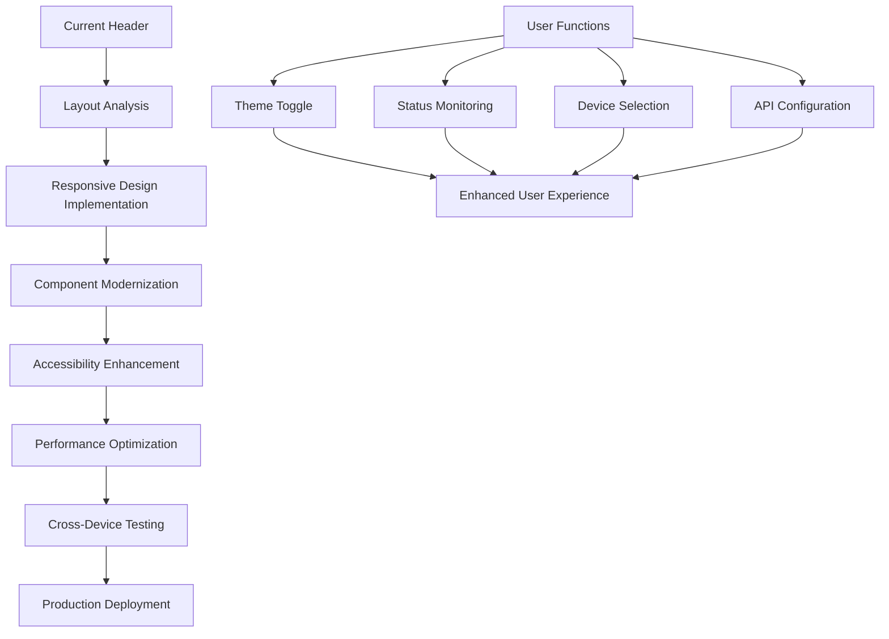

## 1. Product Overview

Modernize the MBPP Smart Waste Management header UI with responsive design, clear visual hierarchy, and enhanced user experience while preserving all existing functionality.

- **Purpose**: Transform the current header into a modern, accessible, and performant interface that adapts seamlessly across all devices
- **Target Users**: Waste management administrators and operators who need efficient access to system controls and status information
- **Value**: Improved usability, faster access to critical functions, and professional appearance that enhances daily operations

## 2. Core Features

### 2.1 User Roles
No changes to user roles - existing authentication and authorization remain intact.

### 2.2 Feature Module
The header modernization consists of the following main components:
1. **Header Layout**: Responsive container with mobile-first design
2. **Navigation**: Enhanced control grouping and accessibility
3. **Status Display**: Improved real-time status presentation
4. **User Interface**: Modern styling with consistent design language

### 2.3 Page Details
| Page Name | Module Name | Feature description |
|-----------|-------------|---------------------|
| Header | Responsive Layout | Implement flexible grid layout that adapts to desktop, tablet, and mobile screen sizes with proper breakpoints |
| Header | Visual Hierarchy | Reorganize header sections with clear information architecture and priority-based element sizing |
| Header | Control Grouping | Group related controls logically with improved spacing and visual separation |
| Header | Status Bar | Enhance real-time status display with better visual indicators and accessibility features |
| Header | User Info Section | Modernize user information display with avatar support and role badges |
| Header | Theme Toggle | Implement enhanced theme switching with smooth transitions and persistence |
| Header | Search & Filters | Add quick search functionality for bins and contractors within header |
| Header | Mobile Navigation | Create hamburger menu for mobile devices with slide-in navigation drawer |
| Header | Accessibility | Implement ARIA labels, keyboard navigation, and screen reader support |
| Header | Performance | Optimize header rendering with lazy loading and efficient animations |
| Header | Interactive States | Add hover effects, focus states, and micro-interactions for better user feedback |

## 3. Core Process

**Header Modernization Flow:**
1. **Layout Analysis**: Current header structure → Responsive grid system
2. **Component Enhancement**: Existing controls → Modern UI components
3. **Accessibility Implementation**: Basic navigation → Full ARIA compliance
4. **Performance Optimization**: Static rendering → Dynamic, efficient updates
5. **Testing & Validation**: Current functionality → Enhanced user experience

## 4. User Interface Design

### 4.1 Design Style
- **Primary Colors**: Maintain existing cyan accent (#06b6d4) with enhanced contrast ratios
- **Secondary Colors**: Refined neutral palette for better readability
- **Button Style**: Rounded corners (8px), subtle shadows, smooth hover transitions
- **Font**: Inter font family with fluid typography scaling (14px-18px)
- **Layout**: Card-based design with consistent spacing system (8px, 16px, 24px)
- **Icons**: Modern icon library with consistent sizing and style
- **Animations**: Subtle micro-interactions (200-300ms duration) with reduced motion support

### 4.2 Page Design Overview
| Page Name | Module Name | UI Elements |
|-----------|-------------|-------------|
| Header | Logo Section | Refined logo container with responsive sizing, proper aspect ratio maintenance, and subtle hover effect |
| Header | User Information | Enhanced user card with avatar placeholder, name display, role badge with color coding, and dropdown menu |
| Header | Status Bar | Modern status display with animated indicators, color-coded alerts, and auto-dismiss functionality |
| Header | Control Groups | Organized control sections with logical grouping, clear labels, and intuitive icons |
| Header | Mobile Navigation | Hamburger menu with smooth slide-in drawer, categorized menu items, and gesture support |
| Header | Search Bar | Integrated search with autocomplete, filter suggestions, and keyboard shortcuts |

### 4.3 Responsiveness
- **Desktop-First**: Optimized for 1920px+ with progressive enhancement
- **Tablet Adaptive**: 768px-1024px with reorganized layout and touch-friendly controls
- **Mobile Optimized**: 320px-767px with collapsible navigation and simplified interface
- **Touch Interaction**: 44px minimum touch targets, gesture support, and haptic feedback
- **Performance**: Optimized images, lazy loading, and efficient CSS animations