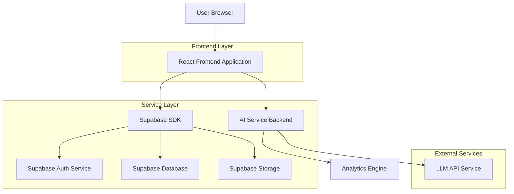
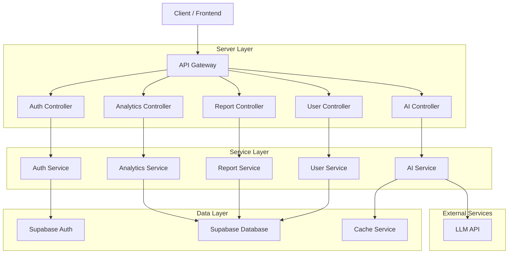
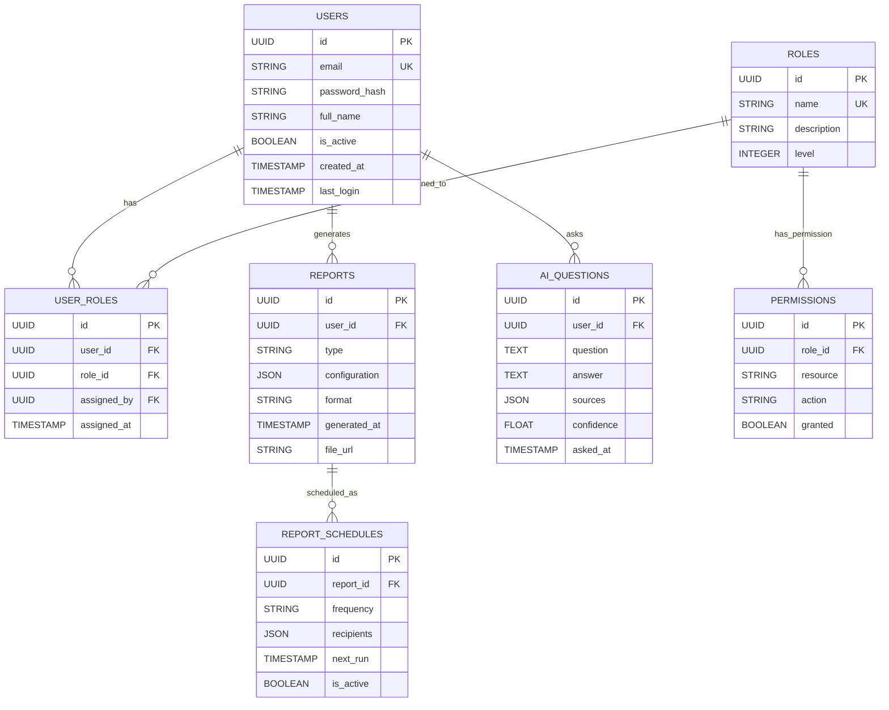

## 1. Architecture design



## 2. Technology Description
- Frontend: React@18 + tailwindcss@3 + vite
- Initialization Tool: vite-init
- Backend: Supabase (Auth, Database, Storage) + Express@4 (AI Service)
- Database: Supabase (PostgreSQL)

## 3. Route definitions
| Route | Purpose |
|-------|---------|
| /login | Authentication page for user login |
| /dashboard | Main dashboard with role-specific overview |
| /users | User management interface (Admin/Manager only) |
| /reports | Report generation and export functionality |
| /analytics | Data visualization and trend analysis |
| /ai-qa | AI-powered question and answer interface |
| /profile | User profile and settings page |
| /logout | Secure logout and session cleanup |

## 4. API definitions

### 4.1 Authentication APIs

**User Login**
```
POST /api/auth/login
```

Request:
| Param Name| Param Type  | isRequired  | Description |
|-----------|-------------|-------------|-------------|
| email     | string      | true        | User email address |
| password  | string      | true        | User password |

Response:
| Param Name| Param Type  | Description |
|-----------|-------------|-------------|
| user      | object      | User data with role information |
| session   | object      | Authentication session token |
| permissions| array      | Array of user permissions |

Example:
```json
{
  "email": "admin@company.com",
  "password": "securepassword123"
}
```

**User Logout**
```
POST /api/auth/logout
```

**Password Reset**
```
POST /api/auth/reset-password
```

### 4.2 User Management APIs

**Get Users List**
```
GET /api/users?role=manager&page=1&limit=20
```

**Create User**
```
POST /api/users
```

Request:
| Param Name| Param Type  | isRequired  | Description |
|-----------|-------------|-------------|-------------|
| email     | string      | true        | User email address |
| name      | string      | true        | User full name |
| role      | string      | true        | User role (admin/manager/contractor) |
| department| string      | false       | User department |

**Update User Role**
```
PUT /api/users/:id/role
```

**Deactivate User**
```
DELETE /api/users/:id
```

### 4.3 Reports APIs

**Generate Report**
```
POST /api/reports/generate
```

Request:
| Param Name| Param Type  | isRequired  | Description |
|-----------|-------------|-------------|-------------|
| type      | string      | true        | Report type (user/performance/project) |
| dateRange | object      | true        | Start and end dates |
| format    | string      | true        | Export format (pdf/excel/csv) |
| filters   | object      | false       | Additional filters |

**Get Report History**
```
GET /api/reports/history?userId=123&limit=10
```

**Schedule Report**
```
POST /api/reports/schedule
```

### 4.4 Analytics APIs

**Get Analytics Data**
```
GET /api/analytics?metric=users&timeframe=30d
```

**Get Trend Analysis**
```
GET /api/analytics/trends?category=performance&period=quarterly
```

### 4.5 AI Q&A APIs

**Ask AI Question**
```
POST /api/ai/ask
```

Request:
| Param Name| Param Type  | isRequired  | Description |
|-----------|-------------|-------------|-------------|
| question  | string      | true        | Natural language question |
| context   | object      | false       | Additional context data |
| userRole  | string      | true        | User role for permission filtering |

Response:
| Param Name| Param Type  | Description |
|-----------|-------------|-------------|
| answer    | string      | AI-generated response |
| sources   | array       | Data sources used |
| confidence| number      | Confidence score (0-1) |

Example:
```json
{
  "question": "What is the total revenue for Q3 2024?",
  "context": {"department": "sales"},
  "userRole": "manager"
}
```

**Get Question History**
```
GET /api/ai/history?userId=123&limit=20
```

## 5. Server architecture diagram



## 6. Data model

### 6.1 Data model definition



### 6.2 Data Definition Language

**Users Table**
```sql
-- create table
CREATE TABLE users (
    id UUID PRIMARY KEY DEFAULT gen_random_uuid(),
    email VARCHAR(255) UNIQUE NOT NULL,
    password_hash VARCHAR(255) NOT NULL,
    full_name VARCHAR(255) NOT NULL,
    is_active BOOLEAN DEFAULT true,
    created_at TIMESTAMP WITH TIME ZONE DEFAULT NOW(),
    last_login TIMESTAMP WITH TIME ZONE,
    updated_at TIMESTAMP WITH TIME ZONE DEFAULT NOW()
);

-- create indexes
CREATE INDEX idx_users_email ON users(email);
CREATE INDEX idx_users_active ON users(is_active);
```

**Roles Table**
```sql
-- create table
CREATE TABLE roles (
    id UUID PRIMARY KEY DEFAULT gen_random_uuid(),
    name VARCHAR(50) UNIQUE NOT NULL,
    description TEXT,
    level INTEGER CHECK (level >= 1 AND level <= 10),
    created_at TIMESTAMP WITH TIME ZONE DEFAULT NOW()
);

-- insert initial roles
INSERT INTO roles (name, description, level) VALUES
('admin', 'System administrator with full access', 10),
('manager', 'Department manager with team oversight', 7),
('contractor', 'External contractor with limited access', 3);
```

**User Roles Table**
```sql
-- create table
CREATE TABLE user_roles (
    id UUID PRIMARY KEY DEFAULT gen_random_uuid(),
    user_id UUID REFERENCES users(id) ON DELETE CASCADE,
    role_id UUID REFERENCES roles(id) ON DELETE CASCADE,
    assigned_by UUID REFERENCES users(id),
    assigned_at TIMESTAMP WITH TIME ZONE DEFAULT NOW(),
    UNIQUE(user_id, role_id)
);

-- create indexes
CREATE INDEX idx_user_roles_user ON user_roles(user_id);
CREATE INDEX idx_user_roles_role ON user_roles(role_id);
```

**Permissions Table**
```sql
-- create table
CREATE TABLE permissions (
    id UUID PRIMARY KEY DEFAULT gen_random_uuid(),
    role_id UUID REFERENCES roles(id) ON DELETE CASCADE,
    resource VARCHAR(100) NOT NULL,
    action VARCHAR(50) NOT NULL,
    granted BOOLEAN DEFAULT true,
    created_at TIMESTAMP WITH TIME ZONE DEFAULT NOW()
);

-- create indexes
CREATE INDEX idx_permissions_role ON permissions(role_id);
CREATE INDEX idx_permissions_resource ON permissions(resource);
```

**Reports Table**
```sql
-- create table
CREATE TABLE reports (
    id UUID PRIMARY KEY DEFAULT gen_random_uuid(),
    user_id UUID REFERENCES users(id) ON DELETE CASCADE,
    type VARCHAR(50) NOT NULL,
    configuration JSONB NOT NULL,
    format VARCHAR(20) NOT NULL,
    generated_at TIMESTAMP WITH TIME ZONE DEFAULT NOW(),
    file_url TEXT,
    status VARCHAR(20) DEFAULT 'pending'
);

-- create indexes
CREATE INDEX idx_reports_user ON reports(user_id);
CREATE INDEX idx_reports_type ON reports(type);
CREATE INDEX idx_reports_generated ON reports(generated_at);
```

**AI Questions Table**
```sql
-- create table
CREATE TABLE ai_questions (
    id UUID PRIMARY KEY DEFAULT gen_random_uuid(),
    user_id UUID REFERENCES users(id) ON DELETE CASCADE,
    question TEXT NOT NULL,
    answer TEXT,
    sources JSONB,
    confidence FLOAT CHECK (confidence >= 0 AND confidence <= 1),
    asked_at TIMESTAMP WITH TIME ZONE DEFAULT NOW()
);

-- create indexes
CREATE INDEX idx_ai_questions_user ON ai_questions(user_id);
CREATE INDEX idx_ai_questions_asked ON ai_questions(asked_at);
```

**Supabase Row Level Security (RLS) Policies**
```sql
-- Grant basic access to anon role
GRANT SELECT ON users TO anon;
GRANT SELECT ON roles TO anon;

-- Grant full access to authenticated role
GRANT ALL PRIVILEGES ON users TO authenticated;
GRANT ALL PRIVILEGES ON roles TO authenticated;
GRANT ALL PRIVILEGES ON user_roles TO authenticated;
GRANT ALL PRIVILEGES ON permissions TO authenticated;
GRANT ALL PRIVILEGES ON reports TO authenticated;
GRANT ALL PRIVILEGES ON ai_questions TO authenticated;

-- RLS Policies for users table
ALTER TABLE users ENABLE ROW LEVEL SECURITY;

CREATE POLICY "Users can view their own profile" ON users
    FOR SELECT USING (auth.uid() = id);

CREATE POLICY "Admins can view all users" ON users
    FOR SELECT USING (
        EXISTS (
            SELECT 1 FROM user_roles ur
            JOIN roles r ON ur.role_id = r.id
            WHERE ur.user_id = auth.uid() AND r.name = 'admin'
        )
    );

-- RLS Policies for reports table
ALTER TABLE reports ENABLE ROW LEVEL SECURITY;

CREATE POLICY "Users can view their own reports" ON reports
    FOR SELECT USING (auth.uid() = user_id);

CREATE POLICY "Managers can view team reports" ON reports
    FOR SELECT USING (
        EXISTS (
            SELECT 1 FROM user_roles ur
            JOIN roles r ON ur.role_id = r.id
            WHERE ur.user_id = auth.uid() AND r.name IN ('manager', 'admin')
        )
    );
```