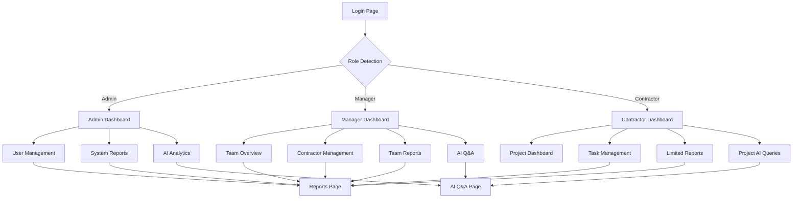

## 1. Product Overview
A comprehensive RBAC (Role-Based Access Control) dashboard system that enables organizations to manage user roles, generate reports, and leverage AI analytics. The system provides differentiated access for Admins, Managers, and Contractors with secure authentication and intelligent data insights.

This dashboard streamlines organizational workflows by providing role-specific interfaces, automated reporting capabilities, and AI-powered analytics to help users understand their data and make informed decisions.

## 2. Core Features

### 2.1 User Roles
| Role | Registration Method | Core Permissions |
|------|---------------------|------------------|
| Admin | Admin creation only | Full system access, user management, system configuration |
| Manager | Admin/Manager invitation | Team oversight, report generation, contractor management |
| Contractor | Manager invitation | Project-specific access, limited data view, task management |

### 2.2 Feature Module
Our RBAC dashboard requirements consist of the following main pages:
1. **Login page**: Secure authentication, role detection, session management.
2. **Dashboard page**: Role-specific overview, analytics widgets, quick actions.
3. **User management page**: User creation, role assignment, permission control.
4. **Reports page**: Report generation, export functionality, scheduled reports.
5. **Analytics page**: Data visualization, trend analysis, AI insights.
6. **AI Q&A page**: Natural language queries, intelligent responses, data exploration.

### 2.3 Page Details
| Page Name | Module Name | Feature description |
|-----------|-------------|---------------------|
| Login page | Authentication | Validate user credentials, implement secure session management, redirect based on user role. |
| Login page | Password reset | Provide email-based password recovery with secure token validation. |
| Dashboard page | Overview widgets | Display role-specific KPIs, recent activities, pending tasks in customizable layout. |
| Dashboard page | Navigation menu | Show/hide menu items based on user permissions with role-based access control. |
| User management page | User list | Display paginated user table with search, filter, and sort functionality. |
| User management page | User operations | Create, edit, deactivate users; assign/modify roles and permissions. |
| User management page | Bulk actions | Enable batch user operations like role updates or status changes. |
| Reports page | Report builder | Create custom reports with drag-drop fields, filters, and date ranges. |
| Reports page | Export functionality | Generate PDF, Excel, CSV exports with customizable templates. |
| Reports page | Scheduled reports | Set up automated report generation and email delivery. |
| Analytics page | Data visualization | Interactive charts, graphs, and dashboards with real-time updates. |
| Analytics page | Trend analysis | Historical data comparison, forecasting, and anomaly detection. |
| AI Q&A page | Natural language input | Accept plain English questions about data and analytics. |
| AI Q&A page | AI responses | Generate insights, explanations, and recommendations based on data. |
| AI Q&A page | Query history | Save and revisit previous questions and their AI-generated answers. |

## 3. Core Process
**Admin Flow**: Login → Dashboard → User Management → Create/Edit Users → Assign Roles → Generate Reports → Analyze Data → AI Q&A for insights

**Manager Flow**: Login → Dashboard → View Team Overview → Manage Contractors → Generate Team Reports → Analyze Performance → Ask AI about team metrics

**Contractor Flow**: Login → Dashboard → View Assigned Projects → Update Task Status → Access Limited Reports → Query AI about project data

## 4. User Interface Design

### 4.1 Design Style
- **Primary Colors**: Professional blue (#2563eb) for primary actions, slate gray (#64748b) for secondary elements
- **Button Style**: Modern rounded corners (8px radius) with subtle shadows and hover effects
- **Typography**: Inter font family with clear hierarchy - 16px base, 24px headings, 14px captions
- **Layout Style**: Sidebar navigation with card-based content areas, responsive grid system
- **Icons**: Minimalist line icons from Lucide React library for consistency

### 4.2 Page Design Overview
| Page Name | Module Name | UI Elements |
|-----------|-------------|-------------|
| Login page | Authentication form | Centered card layout with company logo, input fields with icons, remember me checkbox, primary login button. |
| Dashboard page | Overview widgets | Responsive grid of metric cards with progress bars, activity timeline with avatar lists, quick action buttons. |
| User management page | User table | Sortable columns with status badges, inline edit icons, bulk selection checkboxes, pagination controls. |
| Reports page | Report builder | Drag-drop interface with field selectors, preview pane, export format dropdown, schedule configuration. |
| Analytics page | Data charts | Interactive line/bar charts with tooltips, date range picker, chart type selector, data table view toggle. |
| AI Q&A page | Chat interface | Message bubble layout with user/AI distinction, typing indicators, suggested questions, conversation history sidebar. |

### 4.3 Responsiveness
Desktop-first design approach with mobile adaptation. Sidebar collapses to hamburger menu on tablets, switches to bottom navigation on mobile. Cards stack vertically, tables become horizontally scrollable. Touch interactions optimized with larger tap targets and swipe gestures for mobile users.